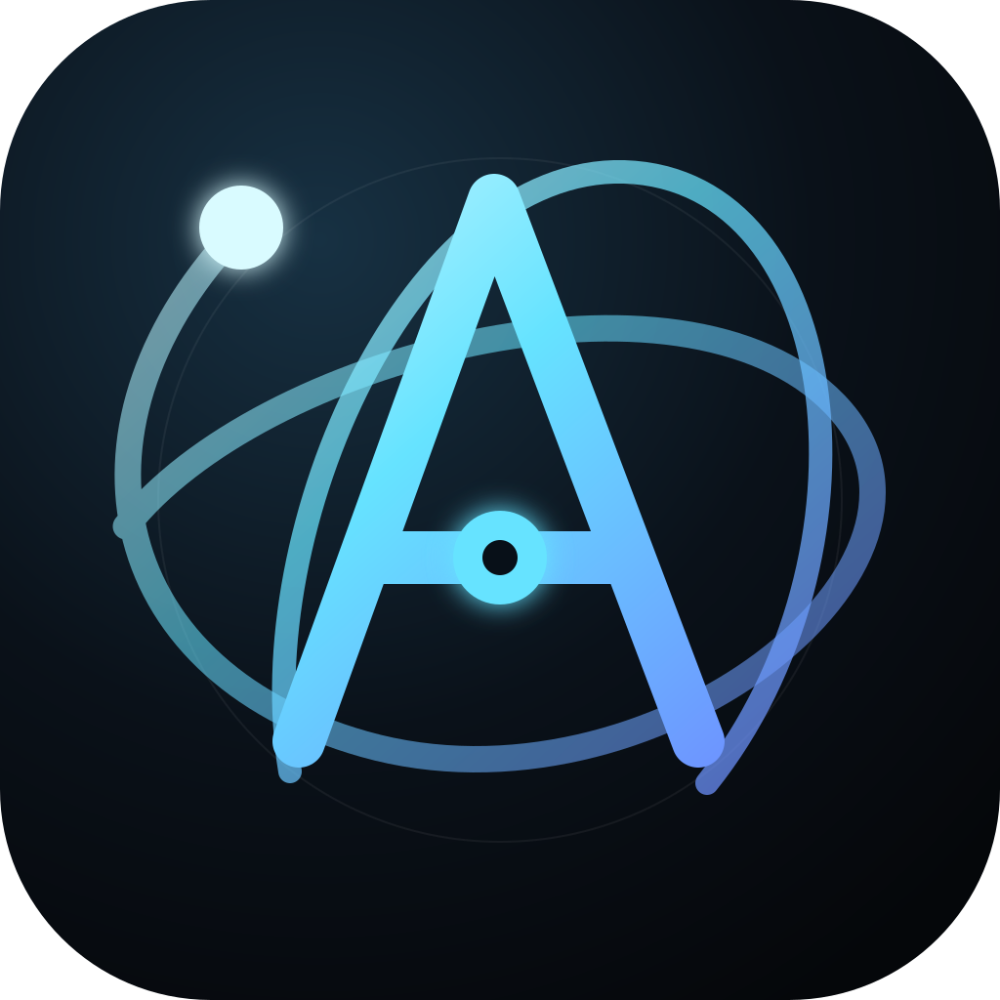
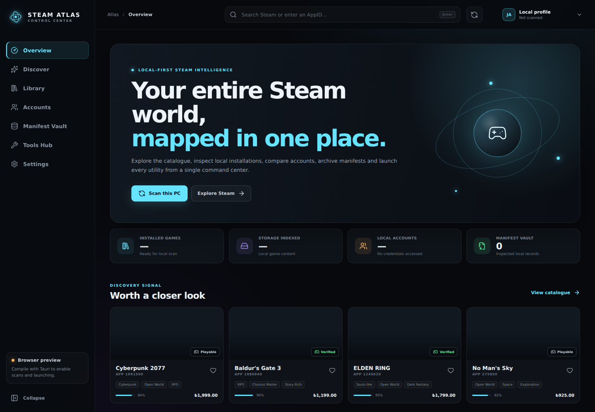

# Steam Atlas 1.0 development

<p align="center">
  
</p>

Steam Atlas is a local-first Steam companion for Windows and Linux, built with
Tauri 2, Rust, React and TypeScript. It unifies store discovery, legitimate
local-library intelligence, account display data, manifest inspection, backups,
trusted-tool launching and a twenty-workbench Power Suite.

> The `agent/v1-game-workspaces` branch is an in-progress 1.0 release candidate,
> not a stable release. Keep independent backups of important data. Steam Atlas is not
> affiliated with Valve, SteamDB, Steam Ladder, ProtonDB or Kaspersky.



## What 1.0 adds

- Per-game workspaces with private notes, ratings, tags, favorites, backlog
  state, save/config locations, launch profiles and local session history.
- Save Vault snapshots with SHA-256 integrity manifests, restore previews,
  mandatory recovery snapshots and explicit retention cleanup.
- Screenshot Studio with exact-AppID indexing, favorites, private tags,
  fullscreen review and honest byte-for-byte export labeling.
- Configuration comparison, reversible Steam client artwork, publisher system
  requirements and Linux/Proton/Steam Deck compatibility details.
- English onboarding, atomic personal-data storage/import/export, dashboard
  module selection, high contrast, reduced motion and Steam Deck/TV mode.
- First-launch trust review for tools and game-aware `Ctrl+K` navigation.

## Beta 0.2 foundation

- Windows 10/11 and Linux support, including native, Flatpak and secondary
  Steam libraries plus Proton-aware diagnostics.
- API keys moved out of WebView `localStorage` into Windows Credential Manager
  or Linux Secret Service. Legacy plaintext values are migrated and removed.
- New **Atlas Node** identity across editable SVG, application icons and social
  preview assets.
- System, dark, light and OLED themes; custom backgrounds; independent panel,
  sidebar and top-bar opacity; blur, saturation, density, scale, radius,
  reduced motion and dual accent colors.
- Keyless local/public account avatars and resilient local-cache/multi-CDN game
  artwork fallbacks.
- Canonical path checks, argument limits, file-size limits, strict external URL
  allowlists, HTTPS timeouts and bounded network responses.
- Windows portable EXE/NSIS and Linux AppImage/DEB build pipelines.
- CodeQL, `cargo audit`, `npm audit`, Dependabot and a controlled draft-release
  workflow.

## Core features

- Steam Store search by title or exact AppID, including games, DLC, demos and
  tools returned by Steam.
- Local account discovery from `config/loginusers.vdf` without reading Steam
  passwords, Steam Guard secrets, sentry files or session tokens.
- Installed-library indexing from legitimate `appmanifest_*.acf` files across
  `libraryfolders.vdf` locations.
- Manifest Vault for inspecting local `.acf` and `.manifest` metadata.
- Authorized SteamCMD launcher. SteamCMD—not Atlas—handles authentication,
  Steam Guard and entitlement enforcement.
- Tools Hub for explicitly selected Windows executables/scripts and Linux
  AppImages/scripts, using argument arrays rather than arbitrary command text.
- `Ctrl+K` command palette, tray restore, safe settings export/import and
  local/offline fallbacks.

Steam Atlas does not fabricate licenses, depot keys or entitlements; unlock
paid content; modify achievements; or automatically delete detected folders.

## The Power Suite

1. Save Vault — dated backups of explicitly selected folders.
2. Launch Profiles — reusable AppID and launch-argument presets.
3. Config Manager — configuration snapshots before edits.
4. Update Intelligence — local BuildIDs with external history links.
5. Library Analytics — platform and disk-footprint summaries.
6. Backlog Board — Backlog, Playing, Completed and Paused lists.
7. Screenshot Studio — exact-game indexing, favorites, private tags and export.
8. Achievement Lens — read-only public progress pages.
9. Compatibility Desk — system requirements, Deck/Proton facts and ProtonDB links.
10. Orphan Scanner — preview-only detection; no deletion endpoint.
11. Duplicate Analyzer — repeated title and install-path detection.
12. Mod Command Center — local AppID associations and Tools Hub integration.
13. Price Watchlist — on-demand Steam Store price refreshes.
14. Session Timeline — local history for Atlas profile launches.
15. Crash Assistant — bounded local signature checks for logs and dumps.
16. Account Compare — safe local/public metadata comparison.
17. Artwork Board — custom references with official Steam CDN fallbacks.
18. Command Palette — keyboard navigation and common actions.
19. Tray Mode — hide and restore from the desktop tray.
20. Portable Settings — secret-free appearance and region transfer.

## Build on Windows

Install Git, Node.js LTS, Rust and the Visual Studio C++ build tools:

```powershell
winget install --id Git.Git -e
winget install --id OpenJS.NodeJS.LTS -e
winget install --id Rustlang.Rustup -e
winget install --id Microsoft.VisualStudio.2022.BuildTools -e --override "--wait --passive --add Microsoft.VisualStudio.Workload.VCTools --includeRecommended"
```

Then, from the project directory:

```powershell
npm ci
npm run desktop:dev
powershell -ExecutionPolicy Bypass -File .\scripts\build-windows.ps1
```

Fresh output:

- Portable: `src-tauri\target\release\steam-atlas.exe`
- Installer: `src-tauri\target\release\bundle\nsis\`

## Build on Linux

Ubuntu/Debian prerequisites:

```bash
sudo apt-get update
sudo apt-get install -y curl build-essential libwebkit2gtk-4.1-dev \
  libappindicator3-dev librsvg2-dev patchelf libssl-dev
curl --proto '=https' --tlsv1.2 -sSf https://sh.rustup.rs | sh
```

Install Node.js 22 LTS, restart the shell, then run:

```bash
./scripts/build-linux.sh
```

Fresh output:

- AppImage: `src-tauri/target/release/bundle/appimage/`
- Debian package: `src-tauri/target/release/bundle/deb/`

The AppImage/DEB must be produced on Linux; the NSIS installer must be produced
on Windows. GitHub Actions builds both on native runners.

## Development and checks

```bash
npm ci
npm run check
npm run desktop:dev
cargo test --manifest-path src-tauri/Cargo.toml
```

Browser preview mode (`npm run dev`) uses clearly marked sample data and cannot
scan folders, access the credential vault, create backups or launch programs.

## Security model

- Optional API keys are protected by the logged-in OS account's credential
  vault and excluded from exports.
- External URLs must use HTTPS and match a small destination allowlist; the
  only allowed Steam URI is `steam://open/games`.
- Executables are canonicalized, extension-checked and launched only after
  explicit selection. Arguments remain an array and are bounded.
- Backgrounds, manifests, logs and network responses have size limits.
- Backup recursion skips symbolic links. New snapshots carry SHA-256 manifests;
  restore verifies them and creates a recovery snapshot first.
- Snapshot cleanup requires confirmation and is restricted to complete
  top-level folders in the Atlas-managed vault. Orphan results remain previews.

Review [SECURITY.md](SECURITY.md), [PRIVACY.md](PRIVACY.md),
[docs/THREAT_MODEL.md](docs/THREAT_MODEL.md) and
[docs/ARCHITECTURE.md](docs/ARCHITECTURE.md) before extending native capabilities.

## Project map

| Path | Purpose |
| --- | --- |
| `src/App.tsx` | Navigation, pages, settings and command palette |
| `src/PowerSuite.tsx` | Twenty local-first workbenches |
| `src/components/` | Atlas Node, artwork recovery and accessible controls |
| `src/styles.css` | Responsive visual and theme system |
| `src/bridge.ts` | Typed frontend-to-Rust command boundary |
| `src-tauri/src/lib.rs` | Steam scans, vault access, backups and safe launching |
| `.github/workflows/` | Windows/Linux build, security and release automation |
| `CUSTOMIZATION.md` | Branding and appearance guide |
| `CONTRIBUTING.md` | Contribution and validation rules |

Release engineering references:

- [Beta-to-1.0 migration](docs/MIGRATION.md)
- [Updater and publisher signing](docs/UPDATER_SIGNING.md)
- [1.0 qualification checklist](docs/RELEASE_CHECKLIST.md)

## Antivirus notes

Unsigned desktop software that reads Steam configuration, opens file dialogs,
creates backups and launches user-selected programs can trigger reputation or
behavioral heuristics. Do not assume every alert is a false positive. Record the
exact detection and SHA-256, rebuild from the tagged source, submit the file to
the vendor for analysis and never ask users to disable antivirus globally.

## License

MIT. See [LICENSE](LICENSE).
